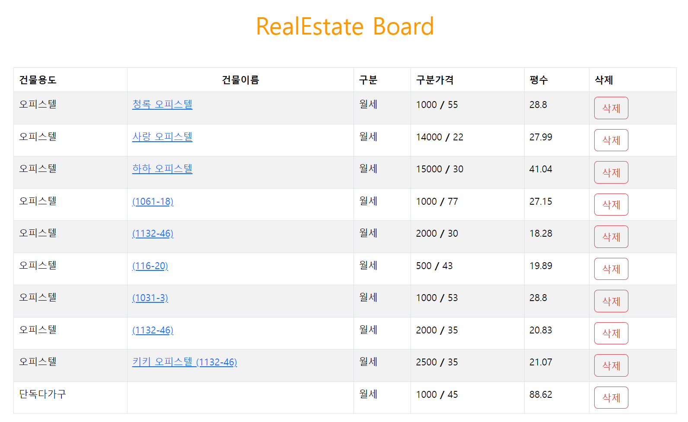
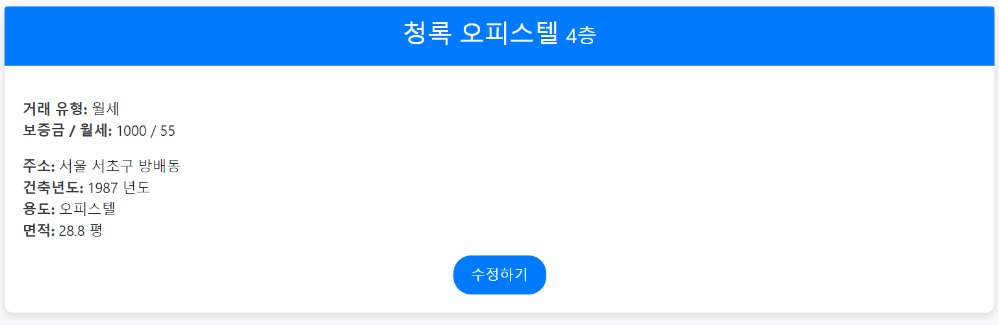
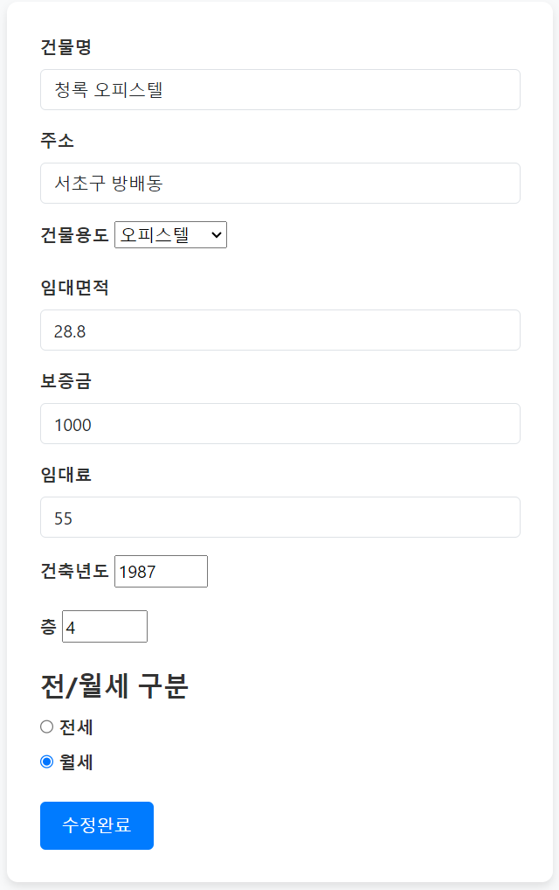

# 프로젝트명

## 은행 미니 프로젝트

부동산 매물 데이터를 불러와 매물을 CRUD 할 수 있음

[데이터 출처: 서울 열린데이터 광장 > 서울시 부동산 전월세가 정보](https://data.seoul.go.kr/dataList/OA-21276/S/1/datasetView.do)

# 기술스택

html, css, javascript, express

# 주요 기능

## 매물 게시물 목록

## 매물 게시물 상세

## 매물 게시물 수정

## 매물 게시물 삭제

# 트러블슈팅

# 소감

**태욱**

> 전반적인 CRUD를 알고 활용할 수 있었습니다. 하지만, 서버와 클라이언트간의 관계와 흐름에 대해서 알고, request가 발생하고 response가 응답하는 사이에 서버의 부하도 신경쓰고 생각하면서 개발을 할 수 있는 첫 계기가 되어서 좋았습니다. 또한 54만개의 데이터를 그냥 find 하는 것이 아니라, 페이지네이션을 함으로써 로딩시간을 줄이는 것도 인상적이었습니다.

**원일**

> CRUD 중 특히 수정 기능을 리액트를 통해 처음 구현해보았는데, 당시에는 해당 기능의 전반적인 부분을 이해하지 못해 굉장히 어렵게 느껴졌습니다. 하지만 이번 기회를 통해 백엔드 단까지 구현해보면서 전체적인 CRUD 흐름을 이해할 수 있었습니다.
